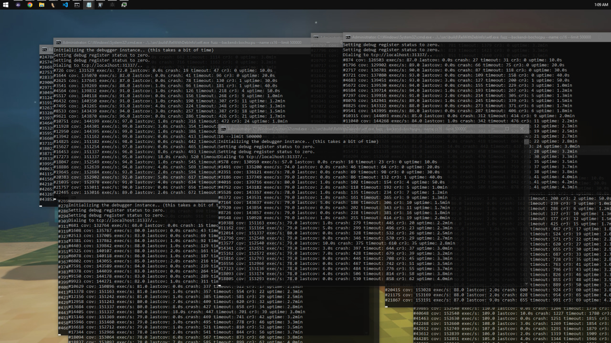
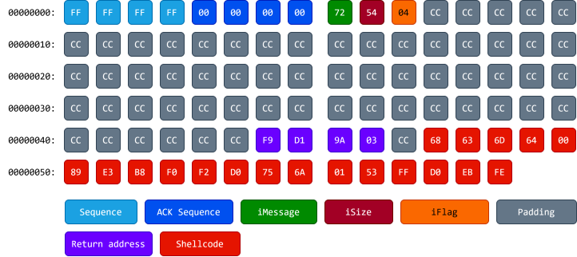

## Introduction

Some time ago I came across this awesome [article](https://hernan.de/blog/lock-and-load-exploiting-counter-strike-via-bsp-map-files/) by Grant Hernandez. I found it incredibly cool, but since I had zero experience in fuzzing, I decided to give it a try myself.

## What is fuzzing?

Fuzzing is a technique where you feed a target program with invalid, unexpected, or completely random data to see if it breaks.

Regular, manual reverse-engineering of a piece of software is not the only way to find bugs, nor is it always the best. Let’s say we have a massive program where a single execution involves thousands of functions and millions of assembly instructions, that makes it quite hard to trace every single execution path.

Fuzzing allows us to find bugs without even knowing the underlying implementation of a particular function or the entire program. Does it sound like a miracle? Well, nothing is perfect in this world, and the same applies to fuzzing.

Fuzzing has its limits. Some bugs are [close to impossible](https://www.youtube.com/watch?v=PJLWlmp8CDM) to find with fuzzing, regardless of how many executions you run; whether it's thousands, millions, or billions. Sometimes a bug is so edgy that the probability of generating the exact required test case is virtually zero. In other cases, it’s not even about the data being passed; the bug might rely on a highly specific program state or condition that we can’t easily replicate in a standard fuzzing environment.

## Why target GoldSrc?

I decided to target *Counter-Strike* because it is a pretty ideal target for fuzzing.

*Counter-Strike* was originally created as a mod for *Half-Life*. *Half-Life*, in turn, was built on Valve's GoldSrc engine (a heavily refactored Quake engine). This engine was written in old-school C, making it relatively simple and quite old. Furthermore, *Counter-Strike* binaries lack modern security features like CFG, ASLR, and SafeSEH, which makes exploitation relatively easy for an attacker. There are also a bunch of GitHub repositories containing leaked source code for various engine versions, which significantly helps when reversing the binaries.

Another reason is that I’m already quite familiar with the GoldSrc engine's internal structures, having developed a couple of cheats for *Counter-Strike* back in the day. This prior knowledge gives me a huge advantage.

---

## My first approach

My initial idea was to target the `.dem` file format parser inside the GoldSrc engine.

The DEM format is used for recorded match demos. Parsing this format is a highly complex process because it essentially contains countless user messages that represent exact player actions at precise times; whether someone moved, jumped, or ducked, it all ends up recorded in the demo. On top of the parsing complexity, we have to remember that the engine will actively try to *play* the parsed data. This opens up an additional vulnerability scope if the playback engine trusts the parsed data too blindly.

### Building the Fuzzer

As for the fuzzing process itself, I didn't know of any good fuzzers for Windows at the time, so I decided to write my own. To handle corpus generation and mutations, I chose [**Radamsa**](https://gitlab.com/akihe/radamsa), a general-purpose mutator. Since its pre-compiled Windows binaries weren't working for me, I compiled and ran Radamsa on Windows using Cygwin.

<video controls>
  <source src="2026-05-29_23-20-50.mp4" type="video/mp4">
</video>

The workflow of this custom fuzzer was straightforward:

1. Pick a pre-recorded, two-second demo file.
2. Generate a mutated corpus using Radamsa.
3. Launch `hl.exe` with the `+playdemo` launch option.
4. Attach the WinDbg debugger to catch and save any crashes.

I also utilized the `msec.dll` plugin, which features the `!exploitable` command; a huge help for classifying and analyzing the crashes.

### Overcoming Engine Obstacles

The first problem I encountered was that the game natively prevents you from launching more than one instance at a time. If you noticed in the video that I am running up to 10 instances simultaneously, that is because I patched the binary check inside `hl.exe` that looks for the global mutex to see if the game is already running.

Another issue stemmed from error handling. During sanity checks, the engine frequently calls `Sys_Error`, which gracefully exits the game after an error. Because of these handled exits, my fuzzer just kept encountering timeouts, significantly slowing down the entire process. I successfully patched these calls out as well.

### The Breaking Point: Non-Determinism and Performance

The main issue with this entire approach and the reason I ultimately gave up on it was non-deterministic execution and terrible performance. The game engine simply wasn't built to be launched in dozens of instances every couple of seconds.

For example, on every single run, the game initializes its in-game browser framework (`libcef.dll`). Upon launching, this component creates a `scoped_dir` folder inside the system `temp` directory, appending a number from 1 to 100,000. If a folder already exists, it creates one with the next number, and so on. I don't quite remember if it failed to clean these up during normal exits or just during hard crashes, but guess what happens when that folder count hits 100,000? The game just starts crashing on its own.

I tried to remove the browser component entirely, but since parts of the main game UI are rendered using this library, getting rid of it wasn't viable. I temporarily fixed the issue by coding a temp-folder cleaner into my fuzzer that ran every minute, but the problems didn't stop there.

The game uses OpenGL as its primary hardware rendering layer (`hw.dll`), with an option to switch to software rendering (`sw.dll`). The problem with OpenGL specifically was that after thousands of rapid executions, it would eventually start crashing randomly with weird exceptions. At that point, I decided it just wasn't worth dealing with all this headache and that it was time to find a completely different approach.

---

## Fuzzing using WTF framework

I started looking into existing solutions, something that would work on Windows, run relatively fast, and be fully deterministic. All of these requirements were met by the [**WTF**](https://github.com/0vercl0k/wtf) fuzzing framework by 0vercl0k. Looking forward, I have to say this fuzzer is an amazing piece of software. I highly recommend trying it out if you plan on fuzzing Windows binaries; it’s truly awesome.

In short, WTF is a snapshot-based fuzzer that executes code using emulation or virtualization. This means our fuzzing is performed directly from a captured state, allowing us to spin up execution at the exact point we want (e.g., right at the call to the parsing function).

However, as I mentioned before, nothing in this world is perfect, and WTF is no exception. Because it is a snapshot-based fuzzer that primarily emulates the CPU, it lacks support for things like disk I/O, which is quite important when your target relies on file parsing. While you can bypass this by hooking the appropriate disk functions to emulate file communication and WTF actually has some built-in disk emulation for this, I didn't know that at the time. Instead, I decided to simply change my target.

### Pivoting to Network Communication

My choice fell on network communication. This attack surface doesn't depend on any disk I/O, just pure, in-memory parsing.

To add some historical context: when GoldSrc was originally developed, roughly 70% of the code was changed or rewritten compared to the original *Quake* engine. However, what remained largely untouched was the network communication layer. This historical legacy is precisely what makes the network scope such an interesting target to fuzz.

GoldSrc’s network communication layer is called **netchan**. It is handled primarily by two main dispatchers:

- `SV_ReadClientMessage`: This function executes on the **server-side** to handle incoming messages sent from the client to the server.

- `CL_ParseServerMessage`: This function executes on the **client-side** to process messages sent from the server to the client.

The server-side dispatcher only parses about 12 distinct messages that a client can send. In contrast, the client-side dispatcher can parse at least 60 different messages, not even counting the special user messages it can also handle. Because of this massive disparity in attack surface, I chose to target the **server-to-client** communication scope (`CL_ParseServerMessage`).

## Taking the VM Snapshot

First, we need to take a system snapshot that will be executed during fuzzing. I initially tried to take a full system dump from a VMware instance using WinDbg, but it failed for some unknown reason. The issue was with the `.dump /f` command; it simply doesn't work inside the VMware virtual machine, exiting after saving only a few megabytes. My guess is that it hits a memory region it couldn't dump, perhaps some network-related or hardware-specific mapped memory.

Because of this, I looked up the recommended setup for WTF, which utilizes a Hyper-V virtual machine instead. This meant I had to reinstall Windows entirely due to the lack of Hyper-V support on my old OS installation. What a painful sacrifice for the cause...

As for the VM requirements, it must run with only a single CPU core (otherwise the CPU emulator won't handle it properly) and the recommended 4 gigabytes of RAM. In my case, 4GB was more than enough to run the game smoothly.

Once the game was launched inside the VM, I attached to the game process using a kernel debugger and set a breakpoint at the `CL_ParseServerMessage` function. As soon as the breakpoint hit, I used the WTF [snapshot](https://github.com/0vercl0k/snapshot) plugin to generate the dump and saved it locally.

## Collecting the Input

Our next step after taking the VM snapshot is to collect the initial input that will be used by the mutation engine to generate our fuzzing corpus.

To gather this data, I wrote a custom DLL that hooks the `CL_ParseServerMessage` function and writes the entire network packet buffer to disk at the exact moment the function attempts to parse it.

<video controls>
  <source src="IMG_5126_(1).mp4" type="video/mp4">
</video>

The results were initially quite promising: after half an hour of playing on various public servers, I collected around 100,000 packets. However, I was filtering their uniqueness based on the hash of the entire packet's data, which turns out to be a terrible metric for network traffic. A single network packet can contain multiple distinct network messages, each handled by different parsers with completely different payload data.

I considered filtering them by message opcodes (operation codes), but that is significantly harder than it sounds. Even having access to leaked engine source code on GitHub doesn't help much here. As I mentioned earlier, the network communication is inherited from the *Quake* engine, it's very old and structured strangely. For some reason, the original developers chose not to use defined message structures; instead, the engine reads data directly from the raw buffer at runtime. Only the individual internal parser functions know how to interpret a given message's length and structure.

To make matters worse, many messages are parsed dynamically on the fly, meaning they don't have a static length. For instance, the exact same message type could be 10 bytes in one packet and 100 bytes in another. I wasn't crazy enough to reverse-engineer and write a custom parser for all 60+ individual message functions just to filter my input.

### The Corpus Solution

I ended up settling on a simpler solution: filtering the packets purely by size. I wrote a script that kept only the 3 most structurally distinct packets for any given byte size.

Knowing what I know now, I would actually just throw all 100,000 raw packets directly into the fuzzer without any pre-filtering. This is because during its initial calibration phase, WTF doesn't actually mutate the corpus. Instead, it executes the original input files as-is just to map out the baseline code coverage. Once that initial coverage run finishes, I could have simply grabbed the minimized, unique corpus generated by WTF in its output directory and used *that* as the clean input for the mutator.

## Creating the Harness

We are now just one step away from running the fuzzer. With our snapshot captured and the input corpus collected, we need the final piece of the puzzle: the harness code itself. This code tells WTF when a crash occurs, when an execution is successful, and which code paths to avoid. Code examples from the WTF repository serve as an excellent reference for building this out, and while I won't dive too deep into the actual implementation because it can get a bit dry, a few specific details are worth highlighting.

To start, I hooked and immediately returned out of all the text-logging and print functions inside both `client.dll` and `hw.dll`, since removing these heavy I/O operations provided a massive speed boost. I also placed termination breakpoints on functions like `Sys_Error` and `Host_Error` to explicitly define our failure states; these functions indicate that the engine's internal sanity checks caught our malformed data, meaning the test case hit a dead end and execution should stop.

The trickiest part was handling the x86 and x64 exception trap. Because *Counter-Strike* is a 32-bit (x86) process running on a 64-bit Windows OS, exception handling gets weird. While most exceptions trigger the x86 `ntdll.dll` exception handler, some exceptions are still routed through the native x86_64 `ntdll.dll` exception dispatcher instead. To ensure absolutely no crash slipped through the cracks, my solution was to hook `RtlDispatchException` on both the 32-bit and 64-bit versions of `ntdll.dll`. Any remaining hooks were placed primarily within kernel functions to act as a final safety net for catching unhandled exceptions.

## Start fuzzing!

The WTF fuzzer is built from two main components: the server and its nodes. The master server is responsible for generating and distributing the mutated corpus to the connected nodes, which perform the actual heavy lifting of executing the target with the mutated inputs.

WTF supports three primary execution backends:

1. **bochscpu:** The slowest backend, but provides full, instruction-level code coverage.
2. **whv (Windows Hypervisor Platform):** A faster, virtualization-backed engine using software breakpoints for coverage.
3. **KVM:** The fastest backend, running natively on Linux and utilizing hardware/software virtualization.

Since I was fuzzing on a Windows host, KVM was out of the question. I tried using the WHV backend, which is theoretically supposed to be about 10 times faster than Bochs, but in my specific setup, it ran several times *slower*. I suspect this might have been because my machine lacked a dedicated GPU. Anyway I ultimately stuck with the Bochs backend.

### Optimizing Performance



When I first started the server with 10 nodes pinned to separate CPU cores, I was getting a meager 75 executions per second (exec/s).

While that was technically enough to make progress on our target, my initial runs were plagued by constant timeouts and frequent CR3 context swaps, which heavily bottlenecked execution speed. By tracking down and fixing the root causes of these slowdowns which usually involved patching out calls to Windows APIs that executed `Sleep` loops or other blocking operations I managed to boost performance up to around **500 exec/s**. For this type of complex engine fuzzing, that speed was more than ideal.

### Triaging the Crashes


After about an hour of fuzzing, WTF began spitting out a variety of interesting crashes.

When evaluating the results, I wasn't particularly looking for basic read or write primitives. Instead, what really caught my eye were **DEP (Data Execution Prevention)** violation exceptions. Triggering a DEP crash meant we had successfully hijacked the original execution path and forced the CPU to attempt to execute memory from a non-executable region. Because GoldSrc lacks ASLR protection entirely, in theory achieving reliable control over a write primitive could easily lead to a arbitrary return address hijack too.

---

## First Crash: Null-Byte Off-By-One


The first memory corruption crash occurred inside `client.dll!MsgFunc_DeathMsg`.

If we look at the underlying code, it looks something like this:

```c
	char killedwith[32];
	strcpy( killedwith, "d_" );
	strncat( killedwith, READ_STRING(), 30 );
```

Here, we have a stack buffer named `killedwith` with a size of 32 bytes. The code first copies the string `"d_"` into this buffer. It then reads a string from our malformed network message using `READ_STRING()` and appends up to 30 bytes of it to the `killedwith` buffer using `strncat`.

You might ask: *How does this result in a crash?*

When we begin appending the network string, our buffer already contains the 2 bytes from `"d_"`. The `strncat` function is designed to append the source string directly to the end of the destination string. Now, you might think that even if the network message string is longer than 30 bytes, it will safely truncate to exactly 30 bytes because of the third argument (`Count`). That is true, but `strncat` always appends a terminating null byte (`\0`) after the copied characters.

This null byte is where the math fails. If we calculate:

$$
2\text{ bytes (d\_)} + 30\text{ bytes (network string)} = 32\text{ bytes}
$$

We have completely filled the `killedwith` buffer. When `strncat` forces its terminating null byte into the buffer, it writes exactly 1 byte beyond the allocated stack space.

Unfortunately for the game engine, this buffer happens to be the very first local variable placed on the stack frame. Sitting immediately after it is the function's saved frame pointer and return address. This out-of-bounds null byte overwrites the least significant byte of the return address. Consequently, when the function hits its `ret` instruction and tries to jump back to the calling function, it redirects to an random code, causing an further exception.

### The Irony of the "Fix”

Truly, a single null-byte overwrite on a return address is very difficult, if not impossible to weaponize for code execution on its own, as it does not allow to control over where you can redirect execution.


However, what makes this specific crash hilarious is looking back at older, leaked *Half-Life 1* source code. Originally, this exact `strncat` call had its `Count` argument set to `32`. That original flaw allowed a massive buffer overflow that could overwrite multiple bytes of the return address, making it trivial to exploit.

Apparently, someone reported that original vulnerability to Valve. Valve "fixed" it by changing the count argument from `32` to `30`. They entirely forgot that `strncat` *always* adds an extra null byte beyond the maximum count if the limit is reached.

It's a textbook example of a failed security patch, but since a single null byte doesn't give us the execution control we want, let's move on to the next crash.

## Second Crash: Stack-Based 4-Byte Buffer Overflow


The next access violation occurred inside `client.dll!TeamFortressViewport::DisplayVGUIMenu` (or a similarly named UI function). You might wonder what a *Team Fortress* function is doing inside the *Counter-Strike* client. I have no idea either, but it is definitely there!

Unlike the first vulnerability, which was completely self-contained, this exploit is a two-stage process. The root cause begins a few functions *before* the actual stack smash happens.

### Stage 1: The Heap Setup

First, the engine reads a map name string from our malformed network packet and stores it in a heap-allocated buffer:

```c
	char m_sMapName[64]; // Struct member/Heap buffer

	char* string = READ_STRING();
	strncpy(m_sMapName, string, 64u);
	m_sMapName[63] = 0;
```

There is absolutely nothing wrong with this snippet. It safely copies up to 64 bytes of our network string into a 64-byte destination buffer and forces a null terminator at the very last index (`m_sMapName[63]`).

### Stage 2: The Stack Smash

The magic happens a few functions later when execution reaches `DisplayVGUIMenu()`, where `m_sMapName` is pulled back into play. The vulnerable code looks like this:

```c
	char sz[64]; // Stack-allocated buffer
	
	strcpy(sz, "maps/");
	strcat(sz, m_sMapName);
	strcat(sz, ".txt");
```

You can probably see the flaw immediately. The code first copies the 5-byte string `"maps/"` into the 64-byte stack buffer `sz`. Then, it appends our `m_sMapName` string using `strcat`.

Let’s look at the math:

- The `sz` buffer is exactly 64 bytes.
- We start with **5 bytes** from `"maps/"`.
- We append `m_sMapName`, which can be up to **63 bytes** long (excluding its null terminator).

By the time the engine finishes executing the first `strcat`, the combined string length is **68 bytes** (5 + 63), meaning we have already overwritten the bounds of the `sz` buffer by 4 bytes.

On top of that, the code blindly appends an additional **4 bytes** for the `".txt"` extension, pushing the out-of-bounds write even further.

Just like in our first crash, the `sz` buffer happens to be the very first local variable allocated on the stack frame. This means the initial 4 bytes of our overflow perfectly align with and overwrite the function's saved return address.

Because those 4 bytes originate from our controlled `m_sMapName` packet string, we gain full, arbitrary control over the EIP register when the function returns. Since GoldSrc completely lacks ASLR protection, these 4 fully controlled bytes are exactly what we need to hijack the execution flow.

---

## Creating the PoC

Great, we have successfully hijacked the return address. Now, how do we weaponize it into a Proof of Concept (PoC)?

### A Quick Note on DEP

Before going any further, it is important to note that the PoC we are building only works with **DEP (Data Execution Prevention)** disabled.

I found it difficult to exploit a standalone 4-byte return address hijack without an established ROP chain, which would require a specific stack-pivot gadget to expand stack into our controlled space first. While I had a few structural ideas on how to achieve full code execution, implementing them would have been a massive time sink. Since I don't plan on selling this, weaponizing it maliciously, or submitting it to a bug bounty program, building a weaponized, bypass-everything exploit doesn't benefit me. The true goal of this PoC is to demonstrate the vulnerability, not to deliver a zero-day exploit payload, so we will build PoC within a DEP-disabled context.

### Finding a Place to Jump

Our initial idea might be to simply jump directly back into our stack buffer `sz`. Since ASLR is disabled, the stack sits at a completely predictable memory address on every execution. We could theoretically place our shellcode inside `m_sMapName`, wait for the engine to copy it into the `sz` buffer on the stack, and redirect execution straight there.


However, a major obstacle emerges when we look at how the engine's `READ_STRING` routine handles input. The parsing loop filters incoming bytes and terminates the string copy early if it encounters either a null byte (`0x00`) or a `-1` byte (`0xFF`).

Without ASLR, the stack for the current thread is typically allocated around the `0x00200000` memory region. Because this address contains a null byte at its most significant position, trying to pass it as our return address fails, the engine truncates the string right before it can ever write our target address over the original return pointer.

### Shifting Targets

What if, instead of jumping to the stack, we jump to the static heap string buffer where `m_sMapName` is originally filled? The address is 4 bytes long, so it will bypass the null byte filtering.

Unfortunately, we hit a similar constraint. The byte filtering makes writing shellcode an absolute nightmare. Because `0xFF` is banned alongside `0x00`, common x86 instructions like `call eax` (`FF D0`) are completely off the table. While you *could* theoretically bypass this by using alternative instruction combinations (like `push eax; ret`), dealing with these tight bad-character filters is an unnecessary headache when you can jump literally anywhere in an ASLR-free binary.


Ultimately, I found a much more elegant solution: jumping directly into the raw network message buffer where the entire packet is stored before user message parsing even begins. This is the absolute origin of our message, offering us a much larger, unfiltered landing pad for execution.

## Crafting the Malicious Network Packet

Now that we know exactly where we want to redirect execution, let’s look at how to construct a malicious network packet that will deploy and execute our shellcode.

### The Packet Anatomy



A standard GoldSrc network packet breaks down into the following structure:

**1. The Netchan Header (8 bytes)**

The packet begins with an 8-byte network channel header:

- **Current Sequence (4 bytes):** This is essentially the packet index number.
- **Sequence Acknowledgement (4 bytes):** The index of the last packet received from the opposite side.

If the arriving sequence number is lower than the engine's current ongoing packet sequence tracking, the engine drops the packet as outdated. We can easily bypass this check by setting this field to the maximum possible value (`0xFFFFFFFF`), ensuring the engine accepts and processes our packet.

**2. Message Opcode / iMessage (1 byte)**

The next byte specifies the message operation code (opcode) within the packet. If this value is between 0 and 59, the engine treats it as a standard engine-level client message. If the value is between 60 and 255, it is treated as a user-defined message. The value `0x72` triggers the specific parsing function that leads to our stack-smashing vulnerability, so we set this byte to `0x72`.

**3. Message Size / iSize (1 byte)**

This byte defines the size of the user message payload and tells the engine how many bytes to copy into the staging buffer. It cannot exceed 192 bytes.

**4. The Flag Byte (1 byte)**


The first byte of the user message payload itself must be set to `0x04`. While I haven't identified its exact internal variable name, this byte acts as a status flag that forces the engine to read and overwrite the local map name (`m_sMapName`) from the incoming payload.

**5. Padding (59 bytes)**

Next, we need a 59-byte padding block. As established during our bad-character analysis, these bytes can be anything as long as they do not contain `0x00` (null) or `0xFF` (`-1`). We use this space to safely fill the buffer up to the exact edge of the saved return address.

**6. The Return Address (4 bytes)**

Immediately following our padding are the 4 bytes that overwrite the function's return address. We overwrite these with the address of the raw user message network buffer.

**7. The Shellcode Payload**

For this PoC, I wrote a compact assembly stub that executes `cmd.exe`:

```nasm
push   0x00646D63      ; Push "cmd\\0" onto the stack in hex
mov    ebx, esp        ; Move the pointer to our "cmd" string into EBX
mov    eax, 0x75D0F2F0 ; Hardcoded address of WinExec()
push   0x1             ; WinExec argument: uCmdShow (SW_SHOWNORMAL)
push   ebx             ; WinExec argument: lpCmdLine (pointer to "cmd")
call   eax             ; Invoke WinExec()
jmp    $               ; Infinite loop to freeze the thread and prevent crash
```

**Note:** For the cause of demonstrating this Proof of Concept, the address of `WinExec` is hardcoded.

---

## Injecting Our Malicious Packet

Now that we have crafted our packet, the question is how to actually deliver it to the client.

### The Problem with Out-of-Band Spoofing

My first attempt was to write a Python script to send a raw UDP packet directly to the client's network address. However, this approach immediately failed because the client's network engine strictly validates incoming traffic; it completely ignores any packets that do not originate from the server's IP and port.

Since I already have a dedicated server running locally, I can't just bind my Python script to the game server's port because the socket is already occupied by the server. On top of that, GoldSrc encrypts and compresses outbound server traffic using Huffman coding, meaning I would have had to manually implement the entire Huffman compression algorithm inside the Python script just to make the packet readable. That was a massive headache I wanted to avoid.

### The Solution: Server-Side DLL Injection

My final, successful approach was to build a custom DLL, inject it directly into the running server process, and hook the internal engine function responsible for outbound network traffic. This allowed me to seamlessly inject our malicious payload into the legitimate data stream.

After testing a couple of lower-level networking functions, I landed on `Netchan_Transmit`. This function turned out to be the absolute ideal hook point for a few reasons:

- It sits right before the data is serialized and sent over the wire.
- It automatically builds the necessary `netchan` sequence headers for us.
- It natively handles the Huffman compression on the fly.

By hooking `Netchan_Transmit`, I didn't have to worry about structural packet math or encryption logic at all. The engine did all the heavy lifting for me.

All I had to do was launch the server, inject the DLL, and wait for a client to connect. The moment a client joined, the hooked function intercepted the stream and fired off our malicious packet.

## Time to test!

With everything in place, it was time to fire up the client and connect to the server.

<video controls>
  <source src="IMG_5114_(2).mp4" type="video/mp4">
</video>

Hurrah! It works perfectly, successfully spawning `cmd.exe` on the client machine and demonstrating a Remote Code Execution (RCE) primitive.

Entire source code of the PoC you can find on my github [there](https://github.com/3a1/Vulns/).

As always; Thanks for reading; I hope you learned something new!

---

## Credits

Although I mentioned them throughout this post, I still strongly suggest checking out these individuals and their incredible work. Without their research and tools, this writeup would not have been possible.

- **Grant Hernandez:** [Lock and Load: Exploiting Counter-Strike via BSP Map Files](https://hernan.de/blog/lock-and-load-exploiting-counter-strike-via-bsp-map-files/) (The original inspiration for this project).
- **0vercl0k:** [WTF (What The Fuzz)](https://github.com/0vercl0k/wtf) and the [Snapshot Plugin](https://github.com/0vercl0k/snapshot) (The amazing fuzzing framework used).
- **Aki Helin:** [Radamsa](https://gitlab.com/akihe/radamsa) (The robust general-purpose mutator).