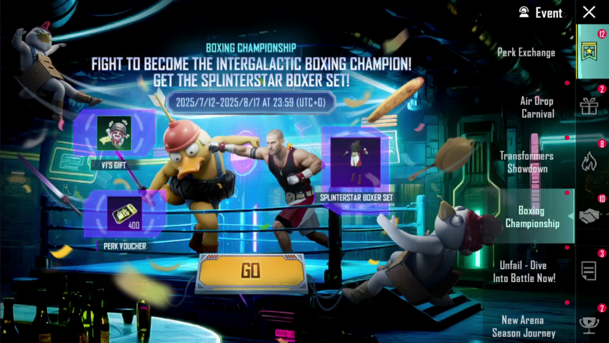
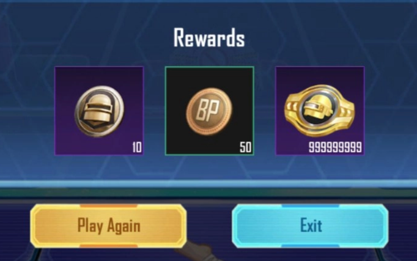

My previous post was about creating an iOS cheat using kernel vulnerabilities. If you missed it, go give it a read. No pressure. This writeup is the second part of poking PUBG Mobile with a stick. Less reading, different topic this time, but still interesting. Today I’m gonna to tell you how I hacked an in-game event. Enjoy reading ;)

## How It Started

Before we dive in, this whole story happened over a year ago, so I don’t remember every detail perfectly. Some parts will be more like vague flashbacks than actual details. But hey, it will still be interesting. 

On 12 July 2025, PUBG Mobile added a new event called Boxing Championship. It was essentially the same as any previous event, you complete some missions to receive a reward. But one thing was different in this event, it was based on a mini-game. Here is how it worked: play matches, do missions, get tickets, play the mini-game, and based on your score, earn actual in-game rewards. The best part? It also had a regional ranking showing the players with the highest scores. 

To my surprise, the mini-game was actually skill-based, some sort of rhythm game. Like Guitar Hero, you need to tap at the right time on the good objects and skip the bad ones. So… isn’t that basically begging to be abused? 

<video controls>
  <source src="assets/output_(1).mov" type="video/mp4">
</video>

My first idea was to download the game on an emulator and write a Python script that takes a screenshot every few milliseconds, comparing the colors on the highway to detect red (bad) or green (good) objects. Honestly, it was not that easy to make. The objects move constantly at different speeds. If the script detects a red object on the highway, we should not click while it’s still there, but we also need to start clicking again once it’s gone. Anyway, after some struggling, I ended up with a working solution, you can see it in the video above. 

So if it works, can we beat the regional ranking? And here is where things get interesting. The best scored player in the Europe region has a record of 20,000 points. That is roughly 30 minutes of continuously playing. You don’t see it in the video because it only shows the start of the game, but once endless mode begins, the speed of the objects is quite fast. I’m not pointing fingers, but let’s be real, those guys at the top aren’t piano prodigies from birth. They somehow managed to trick this mini-game too. Even today, I’m still curious to know how those guys managed to trick it, but unfortunately, after all this time, I don’t think we will ever get the answer. 

## Changing Approach

Anyway, playing for 30 minutes was too long for me. So I went looking for a better trick. I realized the mini-game is fully client-side. Meaning the HP, points, and time are stored and calculated on the device itself. I launched Cheat Engine, attached it to the game, and started scanning for the health value. And… I have found it.

I found the original value for health. Awesome. All I needed to do was change its value, right? …Yeah, that didn’t work. After changing its value, it immediately reverted to normal. It was very similar to changing variables that were being update from the server side. 

I was a little disappointed, but I didn’t give up. It didn’t really make sense to me, because a variable like health should be client side. So I attached a kernel-level debugger and started watching what code actually changes this variable. And I found it, a MOV instruction inside some function was continuously overwriting the value at that health variable’s address. What did I do next? I just placed a breakpoint on that MOV instruction to catch the next overwrite attempt. To my surprise, I started hitting the same breakpoint over and over again. Within a couple seconds, my breakpoint hit count raised to a couple thousand. The health variable was not even being touched at that time. I thought, what the hell is going on with this breakpoint count? 

Back then, I didn’t understand what I was poking around with, because I would never seen anything like it before. But today, I can solve that mystery. Everything come down to the architectural design PUBG Mobile uses under the hood. You have probably noticed that the game can deliver small updates, new events, crates, skins, and so on, without actually updating the game executable itself. The game must use some sort of modular, flexible way to deliver those updates. Something like the interpreted engine, which allows writing new events and their logic in simple scripts that don’t require recompiling the game executable. The one chosen by the game is Lua. 

For those unfamiliar, Lua is an interpreted programming language. Similar to Python, but more for scripting. It uses an interpreter engine available in both C and C++. In addition, it allows calling exported C/C++ routines from within Lua code. This allows the game to ship its executable with a Lua interpreter, export essential C++ functions for rendering (or anything else), and then deliver events or changeable in-game logic purely though Lua script files during small updates. Without needing to recompile the entire game. Awesome. 

Returning to the previous point, what was going on with that breakpoint behavior? The answer lies in how the Lua engine actually works. The Lua interpreter is basically a virtual machine that contains functions for interpreting different actions. It reminds me closely the workflow of obfuscation virtual machines. It may be hard to understand, so let’s use an example. The Lua engine holds all variables on a stack (in RAM). When a Lua script changes a variable’s value, it internally calls the `setglobal(name, value)` function, which performs the actual update. 

So, back to our example with health variable. The entire mini-game is written in Lua. The health variable is just a Lua variable held on the stack. When the health value changes, the Lua engine executes a function that handles its modification. That’s why, when I tried to place a breakpoint at the piece of code that changes the health value, I ended up catching every variable modification inside the Lua engine, not just the health one.

Now that we understand what we are dealing with… How can we hack it? My solution was simple,  place a conditional breakpoint and ignore any write attempt that targets our health address. And it worked.  

<video controls>
  <source src="assets/test.mov" type="video/mp4">
</video>

Wow, now we can’t lose. Awesome, right? But wait, we still need to play for 30 minutes to beat the regional record. If we can change client-side values, why can’t we just change the score itself? That is what I thought, and gave it a try. And it worked. 

I got myself to first place in the Europe regional rating. Pretty funny, isn’t it? 

Obviously, changing the score to something absurd like a string of nines just screams “hey I have hacked that event”. So I didn’t last long before facing consequences, which we will get to next. But for me, it was all fun, I love hacking, that’s it. I believe that with a more realistic score, I could have lasted without any consequences. But where’s the fun in that, right? :D

## Consequences

I was number one in regional rating for two days, until the game moderators stepped in and removed me completely. 

My score remained the same, the only difference was that I no longer appeared on the leaderboard. Were those all the consequences of hacking the mini-game? Sadly, no. 

After that removal, I was looking at my recent profile visits and found one suspicious account. It was the account of one of the game moderators. How did I know? This account was looking very suspicious, it had hidden some stats that you can’t normally hide. On top of that, the account had a cool-looking nickname, but you couldn’t find it by searching that nickname. His nickname didn’t contain any invisible symbols or anything like that. I don’t remember if this account was searchable by UID, but by nickname, you simply couldn’t find it, nothing showed up. A ghost account. Spooky. 

Anyway, a couple of days later, something strange happened. They banned… my nickname. Yeah, you read that right, they banned not my account, but my nickname. I received an email saying my name was restricted. And on top of that, they blacklisted my nickname entirely. Even today, you will not find an account with the nickname “z33bra”, but you also can’t claim it. Their intentions are as unclear to me now as they were back then. It looks like they would rather hide the evidence than actually fix and improve their security. Tencent being Tencent. Priorities, right?

## Infinite Money Glitch

The most interesting part of all this is that I was actually close to creating an infinite money glitch. It all hinged on the fact that after every attempt in this mini-game, you received a 50 BP reward. See where I’m going with this? 

If I could find a flaw that allowed me to play this mini-game without a ticket, or find a way to get infinite tickets, I would be able to start it over and over again. Earning a 50 BP reward on every attempt. This may sound difficult to exploit, since each attempt requires at least 30 seconds of play. But I could simply dump the Lua script containing the mini-game logic, extract its API calls, and make it purely request-based. Without needing to actually play anything or do anything manually. 

Why didn’t I try that? Because this realization hit me after the event had already closed, which is quite sad. For some reason, I didn’t get that idea back when I was exploiting the score system. I’m not pretty confident it was actually possible, but there was a chance. Unfortunately, now we can only speculate whether it was possible or not…

## End

As always, thanks for reading; I hope it was interesting to read :)

See you next time.
