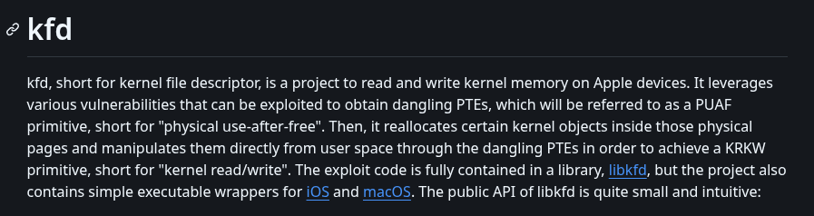
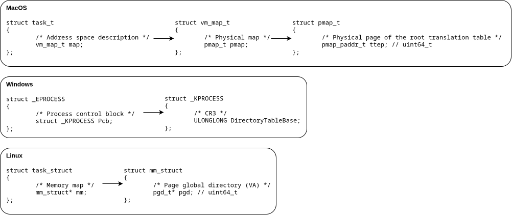

It all started a couple of months ago. Driven by nostalgia for the old seasons I played as a kid, I downloaded the game again. The biggest difference between me and the kid who played this game years ago was that today, I know how to program. So I realized that I could use my technical background to build a cheat using my knowledge as an advantage.

## How It Started

I didn't have a great phone at the time, just an old iPhone XR with a cracked screen, a ghost touch issue, and a bad battery that ran the game at a choppy 40 FPS. Could be always worse. As I never deal before with the Apple's internals, I thought this is a good opportunity to learn more about it.

To make a cheat we need somehow to read the game process memory. I started researching iOS internals to understand how process memory is accessed and read. A lot of articles suggested using functions like `vm_read`, but after a couple of attempts, I found that memory reading didn't really work on iOS. All iOS apps run natively inside the sandbox. Because of the sandbox limitations I repeatedly failed to get the application task port for the reading. Even when I managed to get close it didn’t work as expected.

Once I realized that the iOS memory isolation prevents cross-process access by default, I began looking into other ways to bypass those restrictions. This led me to explore jailbreaking. For those unfamiliar, jailbreaking is the process of gaining the root privileges on an iOS device. It is the iOS equivalent of obtaining root access on Android. This grants access to modify local system files, though still don’t grant control over the kernel drivers or boot chain.

## Jailbreak and Vulnerabilities

So, how does a jailbreak actually works? How they are gaining access of the root user? The answer is vulnerabilities. They use publicly disclosed vulnerabilities and their exploits that allow kernel modification at the runtime. Often, it isn’t just a single vulnerability, but a chain of multiple exploits working together to achieve the necessary capabilities. 

These privileges are typically obtained through kernel memory read/write or physical memory read/write primitives. Aren’t those exact vulnerabilities what I was looking for? If I could modify the kernel memory, I could patch the limitations of the iOS sandbox. And if I could read the physical memory, I could read the memory of any process running on the device. 

I started to look at what jailbreaks are available for my iPhone XR running iOS 16.5.1. After some digging, I found Dopamine. Dopamine is a popular rootless jailbreak. Rootless means all system modifications are stored in a separated directory, making it easier to revert changes without altering the main system volume. This allows you to install custom tweaks, similar to Zygisk modules on Android. These tweaks inject directly into the target process, allowing code execution and memory modifications from within that process address space. 

Process injection is cool, but I’m not really a big fan of internal cheats. I will use that injection in a different purpose later on. The jailbreak injection into a game process is something anticheat is actively looking for. So why take that risk when you can go one level deeper and read the process memory externally? 

## kfd

I began investigating which vulnerabilities the Dopamine jailbreak exploits to manipulate iOS at a kernel level. From the Dopamine app, I learned that my current version uses the kfd kernel exploit. This exploit provides Dopamine read/write kernel memory access by physical memory read/write capabilities. This project will use kfd, but there are bunch of other exploits available too. The project’s compatibility is limited solely by the kfd exploit being patched in iOS 17. However, if you can adapt it to a more recent exploit, it can work on newer iOS versions too. 

If you actually read all that technical mumbo-jumbo above I’m slightly concerned for you. Go touch a grass or something. Jokes aside, we don’t actually need to understand how kfd exploit works. All that matters is that Dopamine uses kfd as its capabilities backend, and somehow other jailbreak components like certain executables can use it too. 

## libjailbreak

Fortunately, the Dopamine jailbreak is open source on Github, so I began poking around exploring how it exposes exploit primitives to other jailbreak components and discovered a dynamic library called libjailbreak. libjailbreak is basically a shared toolbox that all the other jailbreak executables grab and use whenever they need to do something privileged. So here is the logic, if they can use it, we can use it too. We can link that library in our executable and use its exported functions for reading/writing physical memory, translating virtual addresses to physical ones, and all that juicy stuff.

After the device is jailbroken, this library resides in the `{jbpath}/basebin` directory. 

As you can see this library exports literally all the primitives that we are interested in. Essentially a pre-built framework that someone else already created for us. What a time to be alive. 

## iOS Memory Internals

First thing I wanted to know is how do iOS internals especially memory structures even looks like? I’m familiar with Windows and Linux internals, but Apple’s was completely new to me. 

As you can see above, iOS (and MacOS, because Darwin) has structure called task_t. This structure holds all information about a running process. Windows boys, it’s your EPROCESS. Linux folks, it’s your task_struct. 

Inside this task_t structure we have vm_map_t, which describes the address space and contains the physical address map structure pmap_t that ultimately contain the ttep. The ttep is just physical address of the translation table. Similar to CR3 (DirectoryTableBase) on Windows. Same idea, different name. 
On Linux we have pgd with a difference that it points into the kernel virtual address not a physical one. 

This ttep address is exactly what we need to translate virtual addresses to physical ones and read memory of a different process.

Alright, so how we can get that task_t structure of some process? 

Fantastic libjailbreak gives us functions for obtaining proc_t from a PID, and then task_t from that proc_t.

Unfortunately, after obtaining task_t via libjailbreak, we need to manually traverse the structures to reach the ttep. Once we have the process ttep, we can just call libjailbreak’s vreadbuf function and read any virtual address using physical memory access. We could manually use the exported translation and physical memory functions, but why bother when vreadbuf already does everything for us.

## So… What Did We Actually Achieve?

We can read any process memory from a separate executable. Cool, right? But… what’s the actual point?
All we can do is read the game memory. Our executable can’t draw over the screen or simulate touches. So our unfair advantage choice is quite limited. 

### My First Implementation: Webradar

As you might have guessed from the capabilities, the first thing that I build was a classic web radar. I turned our executable into a client that connects to a local server and broadcasts all the player data to it. For the server side, I vibecoded the frontend radar UI (don’t judge) and wrote a backend server to handle the incoming data. 

So here’s the flow, the iPhone client reads player positions, rotations, health and broadcasts it to all devices on the same subnet (255.255.255.255). Meanwhile, the webradar server on PC receives these network packets, unpacks them, and draws the player positions on the radar display. 

<video controls>
  <source src="assets/test.mov" type="video/mp4">
</video>

As demonstrated on the video, this is how the vibecoded webradar works. One advantage of the webradar is that it can be hosted publicly, allowing me to share the link with anyone. Teammates? Sure. Random friends? Why not. My grandma? If she wants to see the enemy positions, she’s welcome.

I also added functionality allowing each web client to customize their settings, e.g. focusing on their own player rotation, changing the map zoom, and whatever else they feel like messing with. This allowed me to play in a full team where I’m the only one with the cheat, yet every teammate who opens the webradar can see all enemies around my position. Essentially, they gain the same advantage without any risking of having the cheats installed themselves.

### Moving Toward ESP

After using the webradar for about a week, I became bored and wanted to expand its capabilities. Why messing with a webradar when I could build an ESP instead? That became my next focus.
We already have a working executable that reads player information, along with functional client-server network communication. For a working ESP, we’re missing just one piece, the ability to draw stuff on the screen. Overlay? Direct rendering? Lines, text, scribbles, I don’t care. Just give me something visual. Typically, game internal cheats hook the OpenGL and render directly. But we’re external, so that’s not an option.

After some surfing over the internet, I stumbled upon this gem of a [blog post](https://bellis1000.medium.com/exploring-the-ios-screen-frame-buffer-a-kernel-reversing-experiment-6cbf9847365) by Billy Ellis.
As I mentioned earlier, our physical memory read/write capabilities also allow us to read and modify kernel memory. In that writeup, Billy found the screen framebuffer variable inside the kernel and demonstrated how to modify the screen buffer directly. Like a boss. So I was excited to find it myself, downloaded the iOS kernel, decrypted it, and spent hours reverse engineering that spaghetti code. Result? Found absolutely nothing similar. Billy found it, I found pain. It’s likely still possible on newer iOS versions, but I simply couldn’t manage to locate it. 

My next attempt was revisiting the libjailbreak library. I found some drawing code inside, tried to execute it, but it turned out to be for boot-stage drawing only, not runtime rendering.

Defeated but not broken, David Goggins mental, I started to look for the other way. If we can’t draw on screen, how the hell does iOS draw its own stuff over the game? Battery percentage, notifications, all that. So I started poking in that direction. I discovered that the main GUI process in iOS is an application called SpringBoard. In short, SpringBoard is the core application responsible for managing the iPhone’s home screen and user interface.

If SpringBoard can draw elements like the “20% Low Battery” popup right in the middle of my fight. Countless times died because of this btw. Then why we can’t just attack it and draw what we want? Since we have a jailbreak, we can create a tweak that injects only into the SpringBoard process and draws on screen just as SpringBoard itself does. 

After building the tweak, I started looking for routines I could call from within SpringBoard. I attempted to create my own window over the home screen, but that didn’t work. So what can we do when we can’t create our own window? Right, we hijack an existing one. So I hooked a bunch of iOS framework routines that handle GUI creation, and bingo, during SpringBoard startup, it calls `UIWindow::initWithFrame` to create its root window. 

In this hook, I call the original `initWithFrame` function so the window actually gets created, then use its handle to add our overlay as a subview. And it worked. 

I drew a circle. Over a game. On iOS. You couldn’t imagine how happy I was. Next, I added a server to the tweak, similar to the webradar approach, and made it render ESP boxes over player positions. The executable client also underwent some changes. Since we’re now drawing player positions on screen, we need screen coordinates, not raw world positions, so a world-to-screen function was added.

## Gameplay

For some reason Notion is showing my embedded videos in glorious 360p. I hope it’s just me. If you’re stuck in pixel hell too, try opening the videos directly via the link and adjusting the quality settings. 

Here’s some TDM gameplay with the ESP overlay visible: 



Due to the FPS issue, I'm rarely recording anything in classics. But I have found a short Ultimate Royale clip with the overlay hidden:



## Hiding the Overlay from Screen Recording

After playing for a while, I got an idea to hide the overlay from the screen recordings. The solution turned out to be quite simple.

To hide the overlay from recordings, first allocate a regular text field. Then enable the secure text property on that field. The same one used for password fields. After that, we simply add our overlay as a subview to that text field, then add the text field as a subview of SpringBoard’s original window. With this simple workaround, our ESP becomes invisible in screen recordings. 

## Hiding the Jailbreak

As I mentioned earlier regarding jailbreak detection, the default Dopamine jailbreak is detected. Same as with most of the banking apps, no surprise here. Realistically, many legitimate players use jailbroken devices, it’s similar to rooting on Android, and you won’t get banned for it. The only limitation is that you can’t play Ultimate Royale, the device security check will simply fail.

The bypass is simple, use a Dopamine fork called Dopamine roothide. It’s essentially the same jailbreak, but with patches that make it harder to detect. The most valuable patch is that the jailbreak directory is now randomly generated during the jailbreak process. This makes it slightly harder for me to push the executable backend over SSH since the path is randomized, but it’s manageable.

## Anticheat Tricks and a Few Words About Detection

Tencent anticheat is known to mess with the mapping, especially to detect the virtual memory readings. The anticheat allocates new virtual memory pages without physical memory backing, then injects these pages (with on-demand mapping) into the actors array. When external software attempts to read one of those malicious actor pointers, it will read an unmapped memory address. This triggers a CPU page-fault exception, which the kernel’s exception handler then processes by mapping an available physical page to that previously unmapped virtual address. The game itself avoids reading these dummy trap pointers, allowing the anticheat to monitor using this trick if someone is accessing the game memory. 

However, when reading virtual game memory physically by virtual-to-physical translation, if the target virtual address lacks physical mapping, the translation simply returns zero. Thus, we bypass these tricky pointer traps entirely.

From my experience the anticheat loves to randomly swap the actors array pointer to some fake  trap address. This typically appears random, but from my observation a player report can also trigger it. The same applies to actors array encryption. On Android, it’s almost always encrypted, while on iOS, the game only encrypts it when it decides to. Glad that the game encryption routine does not change across the game updates. Oh, about the traps, I fixed them by caching the previous valid actors array. If the actors array read fails, we just fall back to the last known working array.

Another thing that the anticheat actively looks for is overlays. They have even got some fancy detection that’s apparently works well on Android. I suspect it’s AI-based detection. Tested myself, rest in peace my main account on Valorant Mobile. On iOS though, I’m not convinced they have anything similar, as the sandbox restrictions likely prevent them from checking for overlays. Anyway, in this cheat we hijack the actual system UI window, the same one that draws the battery percentage and message popups. So yeah, we’re fine, again. 

In recent years, they’ve also started adding more AI-based detections for cheats. I haven’t seen it with my own eyes, but I have heard from others that their AI anticheat can spawn silent bots, they don’t produce the footstep sounds. If you kill one, nothing happens. But if you keep killing these trap bots, the AI will flag your behavior as suspicious and initiate deeper checks. This reminds me of the old days when I was a kid playing on a Counter-Strike: Source server. One time, when I was left in a 1v1 with the server admin, this tricky old man activated an invisibility plugin on his own player model. This made him completely invisible, but since I was playing with wallhack chams, I couldn’t even tell he was invisible. It gave me the same feeling.

In summary, iOS is probably the most vulnerable and easiest OS to bypass the anticheat. iOS restrictions are way heavier than Android’s. On Android, there are actually some potential detection vectors even for the kernel-level cheats through that limited sandbox. On iOS, it’s nearly impossible. In recent years, the only real improvement that I notice has been in jailbreak detection, that’s all about it. And don’t get me wrong, I’m not blaming the anticheat developers for their laziness. They genuinely can’t do much about it. As long as iOS restrictions remain unchanged, it’s nearly impossible to develop effective detection for kernel-level cheats. 

Look, we all hate Tencent as a corporation, it’s practically a hobby at this point. But their anticheat team? They deserve some credit. You may disagree, but in my opinion, their anticheat is currently the best on mobile platforms. What is only worth their dynamic anticheat approach, it activates in-depth checks and traps based on your in-game behavior, and only when it find necessary. The perfect balance between security and performance. And trust me, I have seen anticheats that cut device performance in half just by existing. The newest AI detection and in-game watchdog system, genuinely impressive. 

The only thing I don’t fully understand is some of their decisions. For example, take encryption. Why do they keep the same actors encryption for two years? Why don’t they change it with every update, like other anticheats do? Do you really think the team that forked UE4, entire engine, just to add encryption is too lazy to write a simple compile-time script that randomizes it? I don’t think so. This might sound crazy, but if you sit on it for a sec, you will probably realize that it’s probably an intentional decision. I will leave you on your own conclusions to that. 

## Optimizations

A major challenge during development was optimizing the cheat as much as possible to run smoothly on an iPhone XR. Device that already struggles to run the game at just 40 FPS even without any overlays. There are a couple parts that you might find worth looking at. 

The first is network communication. Since C operate on low-level, we need to build our communication on our own. We are stuck choosing between two classic options of network packets. The TCP or UDP. TCP packets require an established session between devices, which involves a three-packet handshake to set up the connection. Additionally, after every packet is received, the receiver must send back an ACK packet to confirm receipt. And of top of all that, TCP packets must follow a strict order, any packets received out of order are dropped. 

On the other hand, UDP packets don’t require an established session, nor do they follow order or confirm receipt. They are significantly faster and more efficient. TCP is designed for scenarios where you absolutely cannot lose a single packet, even if it costs you speed. For our cheat, we don’t care if we lose one packet in ten thousand, but we do care about CPU usage and receiving speed.

Next is broadcasting. Since both the client and server are C-based, we can easily unpack binary structures and transmit data in raw binary format. I also designed the players array and sending routine to only transmit the array of current players. So instead of broadcasting the entire 64-player array when only 3 are alive, we only send the 3 structures of those players. Did I just reinvent C++ lists? …Yeah, kinda.

I also made pretty massive optimization to the reading loop. When reading the entire actor array, it contains nearly all interactive objects on the map. I have seen the actor count exceed 2,000 several times in Pochinki. Obviously, we need a way to identify the players among all those objects. Like finding needles in a haystack. 

A common method visible above is filtering players by their class name in the global FNamePool array (usually called GNames). You have probably seen this many times. But man… The implementation that people are just copy and paste is horrible. Why read the actor pointer for every single actor? Why use 4 read operations in this function when you can achieve the same with just 2? I don’t have answers. 

Do you even realize how much you are killing your own performance? Let’s do the math. 2,000 actors * 6 reads per actor = 12,000 reads in a single loop. Just to get the information on a couple players. Have some mercy for your CPU guys. That poor thing is working its silicon ass off, boiling alive every nanosecond, just so you can play your game. At least treat it with respect.

Alright, enough joking. Here’s my approach to filtering players. I filter players by reading the UID property of each actor. In my experience, 98% of objects have an empty UID, and even those that don’t will fail the length check. Is this method a bit sketchy? Yeah, sure, I will give you that. But performance? It uses only one read per actor, you can’t beat it. I mean, the only way to beat one read per actor is filter the player by zero reads. I doubt that’s possible, unless find some way to get the players array directly…

Yep, you have read that right. Basically, walking the actors array is the wrong way to find players. Some time ago, I was reversing Valorant Mobile. It uses the same Tencent anticheat, but the engine is less obfuscated. Inside the network class, I found an array of active clients. Each client contained a pointer to a nested structure, which linked to its AActor class. This array only contains real players connected to the server. So instead of reading 2,000 objects on the map and filtering only the players, I could just read the players only array. I tried this in PUBG Mobile, but the array inside the network structure is empty. They have either obfuscated it or moved it elsewhere. But it’s got to be somewhere. If someone actually puts in the time, I’m pretty sure you will find a clean unencrypted players-only array. 

## Compilation and Usage

This writeup is already quite long, even after I have removed couple sections from it. So I don’t want to push here the entire instructions on how to build it.

The instructions on how to compile, install and update the cheat you can find on it’s [Github page](https://github.com/3a1/iOSEsp). 

## A Little Secret

Not much people know about this. Watching the TDM gameplay you could notice that my mechanical skill is quite good. All this on iPhone XR that runs on lagging 40 fps, you should admit that it’s pretty impressive.

The answer is that I’m actually a retired pro player. I was playing this game from the beta release. In season 2 I was the third player in the world that have reached the all three conquerors in a single TPP mode. In solo, duo and squads. I even finished season 2 ranking the six in the world by overall TPP points rating. In season 3 I finished season with 82 K/D for more than 100 matches in duo mode. Even recently on this account that you see the gameplay from, playing on this lagging XR, after two years gap, without headphones, without events, I have reached conqueror in solo mode with 12 K/D. Why I said that I’m retired pro player? I played for a while in a team, even have a t-shirt with my nickname. Sadly that its only duty nowadays is just lying in sofa and gathering dust.  

 

### It was never about cheating

My programming journey actually started because of this game. When I was playing as a pro player, I realized I could grind 8 hours a day, play those stupid daily scrims for free, and do the same thing for years hoping to one year place top 2 in PMSL. That would earn me a slot in the PSML EMEA, main tournament, where a `400,000$` prize pool is shared among all the participating teams. Sounds great, right? …At least until you do the math. So let’s say we place 17th. Could be worse, right? Next time we will be luckier. The `400,000$` prize pool is shared among all participants. So how much do I get? `20k$`? `15k$`? …`3,650$`. Oh wait, my bad. Forgot to split it between teammates. Four… Actually six, because two players were on the bench. In summary… you get `608$`. Enough to cover travel fees and fly back with basically zero. Nice. 

And back then, I completely understood that. In this game, the competitive scene is just an expensive hobby. Even if you are a pro player in one of those sponsored teams that didn’t play any qualifications to get into the main events, you will barely make a penny. Basically doing charity work for your own passion. So, I just started thinking what else I could do instead of spending time on this game. I realized I could learn programming. It would take a couple of years, but after that I could find a job that pays more than enough. And the most beautiful part? I could program a private cheat for myself. 

I could spend 2-3 years grinding this game and get even better than I was. Or I could spend those same 2-3 years learning to code, then build an undetected cheat that gets me to a better level in a week. Sounds unfair? Yeah, I will give you that. But I would call it  choosing the smarter route strategically. I will leave you on your own conclusions. 

## Consequences

I’m fully expecting Tencent moderation to ban the account that shows up in the gameplay and screenshots. I’m not braindead enough to drop my main account’s UID here. The only thing is I hope they don’t issue DMCA takedowns on the YouTube videos, my website, or anywhere else. I intentionally uploaded only two gameplay videos on Youtube. So that, if I do receive a strike, it won’t take down my entire channel. And honestly? I will just re-upload them somewhere else.

## End

As always; Thanks for the reading, I hope you learn something new …or not. 

See you next time.
